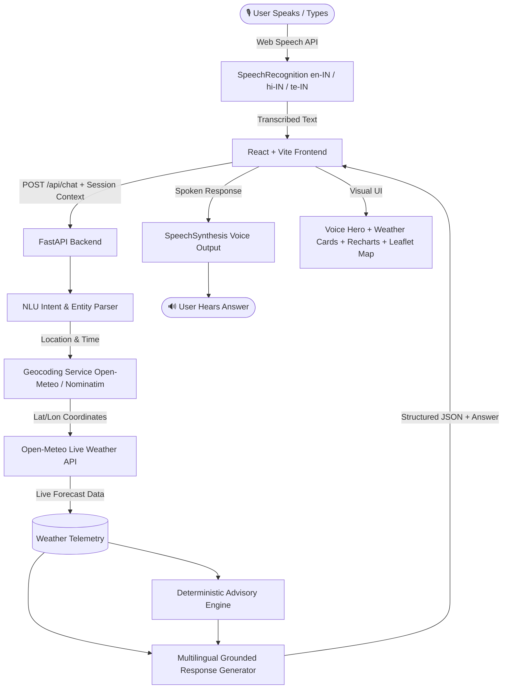

# 🌦️ WeatherGPT — Conversational Voice-First Weather Intelligence Platform

> **Smart India Hackathon (SIH) MVP**  
> WeatherGPT is a voice-first conversational AI weather assistant that translates spoken natural-language queries into structured weather requests, grounds response generation with live **Open-Meteo NWP forecast data**, generates deterministic safety advisories, and synthesizes natural voice responses in **English (`en-IN`)**, **Hindi (`hi-IN`)**, and **Telugu (`te-IN`)**.

---

## 🌟 Key Features

- **🎙️ Voice-First Hero Experience**: Large glowing microphone button with visual audio soundwave animations, instant speech interruption, and audio replay.
- **🌐 Multilingual Indian Language Support**: Full voice & text support for **English (`en-IN`)**, **Hindi (`hi-IN`)**, and **Telugu (`te-IN`)**.
- **🎯 Grounded AI & Zero Hallucination**: AI response generation strictly grounded in actual Open-Meteo weather API data—never invents weather statistics.
- **🛡️ Deterministic Advisory Engine**: Automatic safety alerts for Extreme Heat (≥ 40°C), Heavy Rain, Thunderstorms, High UV Index (≥ 7), Strong Wind, and Travel Suitability.
- **📊 Telemetry Dashboard & Forecast Charts**: 24-hour temperature & rain probability trends powered by Recharts, plus 7-day daily forecast outlooks.
- **🗺️ Interactive Map & Location Search**: Leaflet map integration with debounced city search (Hyderabad, Vijayawada, Delhi, Mumbai, Bengaluru, Tadepalligudem, etc.) and GPS browser geolocation.
- **⚡ Fallback Demo Mode**: Resilient fallback engine ensuring 100% demo reliability even if external APIs or network connections fail during live hackathon judging.

---

## 🏗️ System Architecture



---

## 🚀 Voice Pipeline Flow

```text
🎙️ USER SPEAKS ("Will I need an umbrella tomorrow morning?")
      ↓
Browser SpeechRecognition (en-IN / hi-IN / te-IN)
      ↓
Transcribed Text
      ↓
FastAPI Backend NLU Intent Parser
      ↓
Structured Query: { intent: "umbrella", location: "Hyderabad", date: "tomorrow" }
      ↓
Open-Meteo Weather API (Live Metric Data)
      ↓
Deterministic Safety & Advisory Engine
      ↓
Grounded Response Generation
      ↓
🔊 Browser SpeechSynthesis Output
```

---

## 🛠️ Technology Stack

### Frontend
- **Framework**: React 18 + Vite
- **Styling**: Tailwind CSS + Custom Glassmorphism Design System
- **Icons**: Lucide React
- **Charts**: Recharts (24h Area & Bar Charts)
- **Map**: React Leaflet + Leaflet 1.9
- **Speech**: Browser Web Speech API (`SpeechRecognition` & `SpeechSynthesis`)

### Backend
- **Framework**: Python 3.14 + FastAPI
- **HTTP Client**: `httpx` (async)
- **Validation**: Pydantic v2
- **Server**: Uvicorn

---

## 📡 API Endpoints

| Method | Endpoint | Description |
| :--- | :--- | :--- |
| `GET` | `/api/health` | Service health status check |
| `POST` | `/api/auth/signup` | Register new user and dispatch 6-digit email OTP |
| `POST` | `/api/auth/verify-otp` | Verify 6-digit OTP and issue JWT access token |
| `POST` | `/api/auth/login` | Authenticate user and issue JWT token |
| `POST` | `/api/auth/demo-login` | Instant 1-click login for hackathon judges & evaluators |
| `GET` | `/api/auth/me` | Retrieve authenticated user profile |
| `GET` | `/api/weather/current` | Get current weather telemetry |
| `GET` | `/api/weather/forecast` | Get 24h hourly and 7-day daily forecast |
| `POST` | `/api/chat` | Process conversational natural language query |
| `GET` | `/api/alerts` | Get active weather safety advisories & warnings |
| `POST` | `/api/alerts/broadcast-sms` | Broadcast emergency disaster warning SMS to contacts |
| `GET` | `/api/location/search` | Search city coordinates |
| `GET` | `/api/location/reverse` | Reverse geocode latitude & longitude |

---

## 💻 Quick Start & Setup Instructions

### Prerequisites
- Node.js ≥ v18
- Python ≥ 3.10

### 🚀 One-Click Startup (Recommended)
```bash
# Navigate to repository root
cd WeatherGPT

# Run both Backend & Frontend with a single command
./start.sh
```

- **Frontend App**: `http://localhost:5174`
- **Backend API**: `http://localhost:8000/api/health`
- **Swagger Docs**: `http://localhost:8000/docs`

---

## 🎬 Hackathon Live Demo Walkthrough

1. **Demo 1 — Instant Judge Access & Voice Question (English)**
   - Click **"⚡ Instant Judge / Evaluator Demo Access"** to immediately sign in.
   - Click the central glowing microphone button.
   - Say: *"Will I need an umbrella tomorrow morning?"*
   - WeatherGPT speaks back with live telemetry chips and rain advisories.

2. **Demo 2 — Multilingual Support (Telugu & Hindi)**
   - Toggle language to **తెలుగు** or **हिंदी**.
   - Click a localized suggestion button like *"నాకు గొడుగు అవసరమా?"* or *"क्या मुझे छाते की जरूरत है?"*.
   - WeatherGPT responds in fluent Telugu/Hindi native script and voice output.

3. **Demo 3 — Weather Intelligence & Travel Advisory**
   - Ask: *"I'm going to college tomorrow morning. Should I carry a raincoat?"* or *"Is it safe to travel tomorrow?"*.
   - WeatherGPT evaluates rain probability, temperature, wind, and UV index to provide actionable advice.

4. **Demo 4 — Active Safety Advisories & Level-1 Alerts**
   - View active high UV radiation, extreme heat, or heavy rain warning banners with explicit safety recommendations.

5. **Demo 5 — Emergency Disaster SMS & Buzz Alert Siren (EAS)**
   - Click the **"🚨 Alert SMS"** button in the navbar (or on critical hazard banners).
   - The platform initiates a real-time Emergency Broadcast System dual-tone audio buzz and haptic phone vibration.
   - Add your test phone numbers and click **"Broadcast Emergency SMS & Buzz Alert"** to dispatch disaster warning SMS alerts.

---

## 📜 License
Developed for Smart India Hackathon. Open source under MIT License.

